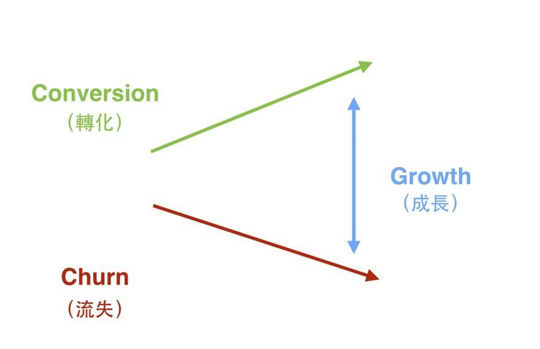

# 第1章：優先目標：成長（Growth）

創業團隊看到成長駭客，想要把它當成新的吸金術，但這可能犯了成長駭客的大忌。而且對許多剛剛發展起來的中小型團隊來說，比起成長駭客，我們更應該先知道的是「正確且健康的成長觀念」，掌握了正確的成長公式，後面的成長駭客手法才有著力點。

## 第1課：成長的真正公式，矽谷創業團隊追求的核心目標

--- 為什麼知名創投YC要求創業團隊每週成長7%？

在開始進入Growth
Hack（成長駭客）的實戰策略之前。我更想談談的其實是Growth（成長）這個主題。

Y Combinator創辦人Paul Graham曾經寫過一篇文章：「[Startup = Growth](http://www.paulgraham.com/growth.html)」。

Onemonth 的創辦人 Mattan Griffel 也寫過一篇文章：「[Y Combinator and The
One Metric that Matters](http://learn.onemonth.com/y-combinator-and-the-one-metric-that-matters)」

他們明確的提到一件相同的事。

在YC，所有創業團隊都只被明確要求一件事：Growth（成長），一個好的Growth
Rate是你的Startup每週成長 7%。

而如果你的Startup沒有到這個速度，每週只有1%，那表示你的Startup可能哪裡做錯了。

「成長」之所以重要，是因為當你的公司不成長，其餘都是白費力氣。

同時若如果你把精力都放在成長。每週都逼問自己和整個團隊，我們這週要怎麼做才能成長
7%，那你的團隊就會自然而然的上下同心。

問題是，這裡的「成長」是什麼意思？

### 成長不等於曝光

很多人對於Growth或Growth
Hacking的認知是以為「成長」就是「曝光然後帶來巨量曝光」好像流量、眼球就是行銷與開發產品的唯一目的，事實上，「成長」不是這麼回事。

甚至若你將週週成長 7% 這個條件帶進來，你會發現 Growth
絕非僅僅只有「曝光」這麼簡

單。

製造一次的行銷事件，玩一次巨量成長很簡單，但它會花上你「巨量的資源」，如果條件是週週都成長7%，公司的策略就不會是「曝光」，因為不可能有那麼大量的預算去執行這樣的成長。

而7%這個條件會促使你時時都在思考：「公司長期與短期的成長策略是什麼？」團隊就不容易走進歧路，更加的聚焦，更加「健康的生長」。

### 成長就是：讓轉換率大於流失率

那麼Growth是什麼？這裏我先給出一個簡單的公式：「Conversion（轉化） -
Churn（流失）=Growth（成長）」。

#### Conversion（轉化）

下面這些行為通常稱之為「轉化」。

-   在 FB 上看到廣告點擊
-   變成註冊會員
-   訂閱每月方案
-   下單付費購買

#### Churn（流失）

下面這些行為通常稱之為「流失」。

-   刪除帳號
-   丟棄購物車

而不斷的拉高「轉換率」，降低「流失率」，這個過程就叫Growth。

大家有看到其不同點了嗎？專注傳統行銷的話，通常想到的就是不斷的曝光再曝光，或是讓品牌產生影響力。但是「專注成長」的話，其實我們更注重去降低客戶疑慮（拉高轉換率）、增強客戶信心（降低流失率），於是一個由內而發的健康成長便可以發生。

## 第2課：為什麼先注重成長？而非成長駭客？

--- 什麼時候才需要開始Growth Hack？那之前怎麼辦？

為什麼我要先談Growth（成長）這個議題？又與Growth Hack（成長駭客）有什麼差異？

先說結論，就是因為大部分的公司，其實不一定需要Growth Hack，大家所需要的是Growth。

為什麼？讓我們細說從頭。

矽谷常見給不同層級團隊打分的標準是：

* 10分：沒人用的產品
* 20分：Minimal Viable Product（MVP，擁有最小可行性產品）
* 40分：產品可以跟顧客收錢了
* 60分：Product Market Fit（PMF，產品達到讓客戶需要你的市場規模）
* 75分：客戶回流高
* 90分：壟斷市場

而矽谷對創業團隊的建議是，還沒Product Marketing Fit的團隊，不需要玩 Growth Hack，只要專注在於Growth就好！

### 為什麼中小規模團隊更應該先注重「成長」

很多中小規模公司，能夠衝到Product Market Fit的階段，都是靠蠻力硬衝起來的，但是之後 就會遇到成長瓶頸。

這是因為幾點原因：

-   踩到機會財
-   老闆本人威能，但同事一般
-   商品部分特色踩到痛點，但是並沒有完全解決市場需求
-   同事並不是有愛才來這個公司上班，而是為了「高薪」

而這時候你的公司在產品執行與銷售上一直「漏水」，像是用廣告吸引了很多人來看你的產品，但看看後很多人都走了，或是用了一陣子之後都不再來了，這時候你的行銷就像漏水一樣，什麼都留不住。

在這個情況下，執行Growth Hack一點意義都沒有，大部份的團隊，其實需要的是將銷售漏斗上的大洞補起來，也就是前面提到的成長公式：

> 轉換率\>流失率

依據前面提到的那個計分標準：

* 10分：沒人用的產品
* 20分：Minimal Viable Product（MVP，擁有最小可行性產品）
* 40分：產品可以跟顧客收錢了
* 60分：Product Market Fit（PMF，產品達到讓客戶需要你的市場規模）
* 75分：客⼾回流高
* 90分：壟斷市場

60分以前只需Growth，在矽谷，通常會建議創業者不要貿然進行Growth Hack，因為Growth
Hack也是Marketing的一種，既然是Marketing，就必然燒資源。

我建議各位在進入60分PMF之前，其實只需要做一件事，就是專注的Growth（成長），本書也會在這部份下工夫。

[名詞解釋：MVP]

MVP，全名為Minmal Viable Product，這個字大家耳熟能詳，創業的部落格，常常提到這個
名詞，但是中文翻譯很難理解。因為大家通常是這樣翻譯的：

-   最小可行性產品
-   最小的解決方案

這到底是什麼呢？在這裏用一個比較傳統的例子去解釋，各位讀者應該比較能夠知道MVP是麼狀態。

比如說，今天你開一家雞排攤，在這個雞排攤你至少有一道產品：炸雞排，這個雞排就是你
的MVP，Minimal Viable Product。

[名詞解釋：PMF]

PMF，全名為Product Market Fit，這個字大家也常在創業部落格提到，但是對這個狀態也不 熟悉。

這個狀態的定義其實就是：在生意開張之後，穩定可以經營下去，繼而養得起員工，持續成
長，這個狀態就是PMF。

以開雞排的例子，就是比如說你經營這家攤子，生意開始不錯。但是經營得很累時，想要花兩個時間禮拜去日本自由行，玩到心情爽再回來開店。結果回來之後店的生意還沒有掉，這個狀態就表示達到了PMF，客戶已經真正需要你。

## 第3課：成長駭客不是萬靈丹，先挑對適合成長的產品主題

--- 創業團隊對各種新吸金方法總是趨之若鶩，但這卻是執行成長駭客的大忌

＠內文：

在繼續談下去之前，我還想分享一個重大的觀念：「不是今天挑任何一個題目，套上Growth
Hack的技巧，就能『發大財』」。

當然，我知道很多讀者會買今天這本書，可能是抱持著這種想法（笑），所以我要一開始就先建立正確的觀念。

### 適合「成長」的主題必須是你的快速PMF主題

我建議各位讀者在挑選創業主題，或者執行創業主題、並進行Growth策略的時候，特別注意檢視，您手上的這個主題是不是屬於「快速
PMF」主題。

不是的話，我建議您可能要考慮換掉！錯誤的主題加上Growth，並不會讓你走到應許之地。

什麼是「快速
PMF」主題？我後面會立刻解釋，但讓我們先來檢查自己是不是陷入下面這樣的創業繆思。

在這裡我想舉一個經典例子，其實這在網創界也經常看到，只是形式不同而已。就如同現在
的O2O亂象：創業者幻想任何服務+Google
Map+Growth就可以發大財，只會朝著吸金的地方前進。

在上一節我們曾經拿雞排攤舉例子，但其實想發財的創業者，並不會想要挑雞排攤當例子，因為一塊雞排
60 元，賺太慢了，真的要快速賺錢，他們會打這樣的算盤：

一塊高級牛排大概3000元台幣
一天賣100份，營業額是30萬，一個月賣30天營業額是900萬 ，一年12
個月營業額是1億800萬。

所以他們的創業計畫書會這樣寫：我打算賣牛排，因為牛排單價高，有市場需求。然後再畫
出一個漂亮的業績預估圖，再跟創投募資投售。至於如何達到業績目標？用現在大家說的Growth
Hack就達到了！（笑）

這個例子當然很荒謬，但是，如果你仔細觀察現在檯面上的創業團隊，10組大概有7組都是抱持著類似的想法。

### 什麼是快速PMF主題？

一個適合Growth的主題，我觀察其實有兩類特點：

創業者自身很熟的主題

周遭需求量很大的主題

#### 創業者自身很熟的主題：

創業者很熟的主題。比如你很會煎牛排，朋友都說你煎牛排超好吃，很喜歡去你家吃飯。久
而久之建議議你開館子，或做私廚。

這樣的情況下，你才適合去開牛排館。

而不是你只會炸雞排，卻嫌雞排賺太少，做完市場調查之後，覺得應該去開高級牛排館。原因卻只是牛排館賺的比較多。

#### 周遭需求量很大的主題：

第二種類型是：周遭需求量很大的主題，因為需求量太大，所以剛開始沒有做得很好沒有關係。

舉個例子來說，假設你家方圓2公里之內，都沒有雞排攤。那麼你隨便開一個雞排攤，炸的再
難吃，都會有人上門購買。

### 為什麼快速PMF主題容易衝到60分？

為什麼上述這些特點屬於快速PMF主題？

因為這些主題，創業者一出場時就能迅速拿到20分（最小可行性產品），並開始累積用⼾。只需要花一點精力，或者針對客人回饋修正方向，很快就能衝到40分（可以開始跟顧客收錢），3\~6個月就可以收支平衡逼近60分。

很多人創業死亡的原因，是因為挑選了一個0分的題目，一個對你自己來說不具可行性的產品。

在創業的過程中，花了很多的冤枉學費，先砸了超多錢，才在一邊開店之中學煎牛排，學調
整菜單，學管理員工，花了很多時間與金錢，只拼到30分，最後就倒了。

所以在這裡想先提一個重要的課題，如果你想要學Growth
Hack，或者是準備創業，我會建議大家先檢視先自己現在玩這個主題，是不是快速PMF主題？

而不是隨便從國外抄一個 idea，再拿回台灣就以為做得起來。

除非你真的對這個項目很熟。

除非台灣也真的很缺這個服務。

否則我會建議你別貿然投入，甚至花上資源「Growth」。

所以，這一章要告訴大家的就是，在操作Growth
Hack各式各樣的成長駭客策略之前，我們依然必須把握住兩個基本核心：

＠大字引言設計：

1.成長：就是轉換率大於流失率。

2.快速PMF主題才能有效成長。

\@引言完\-\-\-\-\--
