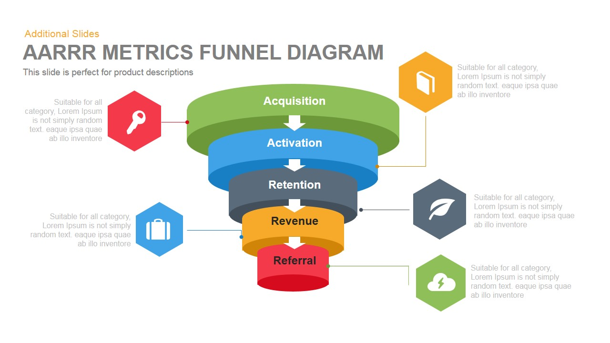
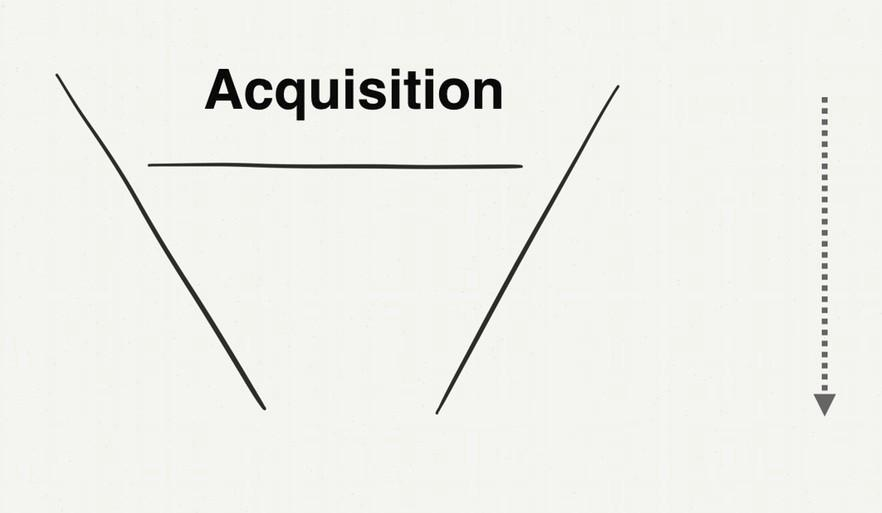
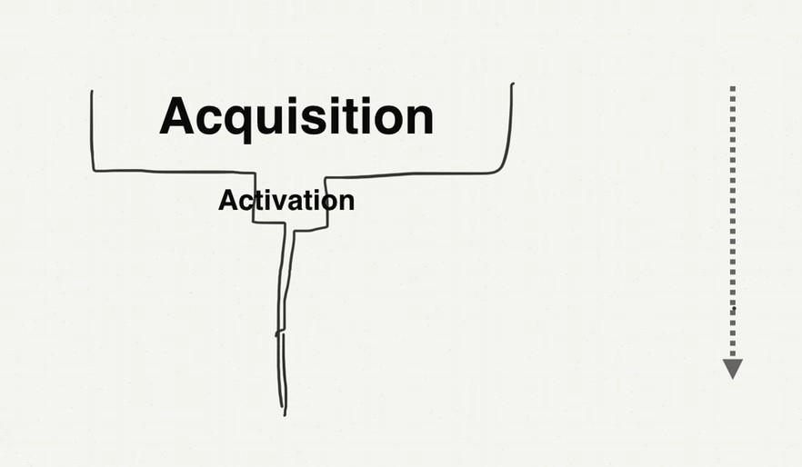
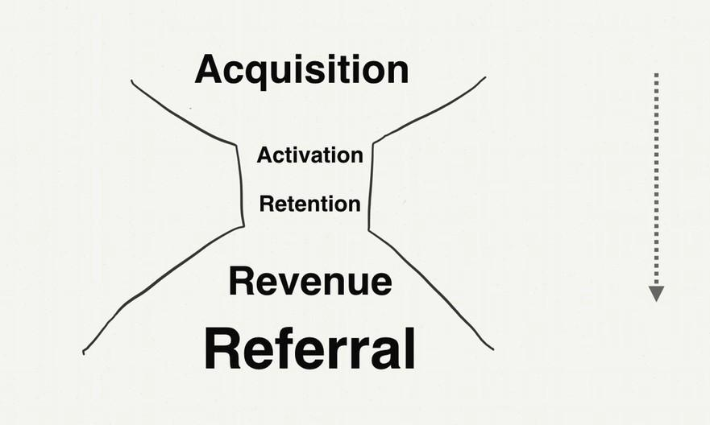

# 第2章：改進傳統行銷漏斗

＠Opening：

前面一章我們提到了成長駭客的核心精神，就是讓轉換率大於流失率，以及找到快速PMF主題。那麼在具體的產品策略流程上，成長駭客可以在哪些策略環節發揮效用呢？在這一章，我們用AARRR行銷漏斗來解釋傳統行銷與成長駭客行銷的關鍵不同。

＠中標：第4課：來客如何變顧客？關鍵的五個行銷階段
-------------------------------------------------

＠副標：先認識行銷漏斗，所謂顧客的生命週期

＠內文：

講完Growth與Growth Hacking的差異。我們要先來講一點行銷策略。

一般來說，我們會把顧客消費的生命週期分為五個階段：

Acquisition（用戶獲取）

Activation ( 用戶激活）

Retention（用戶留存）

Revenue（擴大營收）

Referral（推薦使用）

他可以被畫成下圖這樣的一個行銷漏斗，也就是從上方倒入流量、過課後，會經過一個階段一個階段的過濾，最終留下核心的忠誠使用者。

{width="6.267716535433071in"
height="3.5277777777777777in"}

\@圖：AARRR（＠美編：這張圖可以做成一整頁，參考這張圖中間的行銷漏斗圖，重新畫成符合本書風格，並且中間的文字做下列修改：

Acquisition（用戶獲取）\-\-\-\--用戶如何找到你？

Activation ( 用戶激活）\-\-\-\--用戶有沒有留下好的第一印象？

Retention（用戶留存）\-\-\-\--用戶還會回來嗎？

Revenue（擴大營收）\-\-\-\--用戶願不願意付錢？

Referral（推薦使用）\-\-\-\--用戶會推薦別人嗎？

）

### ＠小標：Acquisition（用戶獲取）

Acquisition常見的手段大家應該不陌生，包含了：

-   SEO

-   FB廣告

-   部落客置入推薦文

-   Line行銷

-   流量行銷

-   EDM

也就是讓我們的產品或服務在用戶面前曝光手段，開始把來客帶入這個行銷漏斗。

### ＠小標：Activation ( 用戶激活）

但是過客不會對我們的產品產生任何正向作用，所以我們必須嘗試去「激活」用戶，也就是讓用戶採取行動，通常包含了：

-   註冊帳號

-   下單購買第一個產品

-   從免費升級成付費

也就是讓用戶進行第一個轉化（付費）動作的手段，這時候我們開始想辦法把來客留在這個行銷漏斗中。

### ＠小標：Retention（用戶留存）

這一個步驟要做到的是，用戶不僅第一次購買了你的產品，他還會想要回來購買其他的相關產品，或是真的把你的產品當作他持續使用的服務，通常包含了兩種要件：

-   用戶持續使用

-   用戶購買更多產品

也就是說用戶在這個階段真正喜歡你上你的產品，才會持續回流使用。

### ＠小標：Revenue（擴大營收）

當已經擁有一群喜歡你的產品的顧客後，我們要思考的就是如何讓這些顧客購買更多或更貴的東西，例如服務的升級方案，這通常包含了下面幾種情況：

-   讓顧客買更多東西

-   讓顧客願意買更大的方案

-   漲價

我們可以看到很多服務會有分為入門版、進階版或企業版，其實就是讓顧客進入行銷漏斗，並且一步一步提升他們付費的額度，才能擴大自己的營收。

### ＠小標：Referral （推薦使用）

而一個產品如果會開始瘋狂成長，通常都是他達到了這個AARRR行銷漏斗的第五個階段，也就是用戶願意主動把你推薦給他人，介紹他的客戶與朋友一起來使用你的產品。

有了上面的基本概念，知道來客如何經過行銷漏斗才能成為忠實顧客後，我們就能開始檢整傳統行銷手法的問題，並看看Growth
Hack（成長駭客）的策略從哪裡著手幫我們改進成長問題。

＠右起：

＠中標：第5課：為什麼不成長了？傳統行銷遇上的成長天花板
-------------------------------------------------------

＠副標：什麼原因造成砸了預算但顧客數量還是在撞牆期？

＠內文：

為什麼傳統行銷很難幫助產品成長？我認為有兩個原因：

＠大字引言設計：

1.行銷漏斗不健康

2.頻道消退效應

\@引言完\-\-\-\-\--

我們可以透過前一課的行銷漏斗，去檢查自己的集客手段中，是不是缺失了哪些部分？才造成我們前面章節提到的負成長，也就是最終「流失」比「轉換」多的壞現象。

### ＠小標：為什麼我們的行銷漏斗不健康？

知道行銷漏斗之後，你可以特別注意到一件事，其實現在大部份行銷界談的往往僅是：用戶獲取（Acquisition）=\>
用戶激活（ Activation） 這一段而已。

所以行銷手段就是：不斷的曝光 =\> 顧客轉換，重複循環而已。

這樣的行銷手法行之有年，可見他也不是沒有效，甚至在大家的印象中可能還覺得這樣的方式是有效的，或者是唯一的方法，只是，你我都知道，這樣做：

＠大字引言設計：

真的非常燒錢。

\@引言完\-\-\-\-\--

而這其實就不是我們前面章節提到的健康成長。

### ＠小標：對行銷漏斗的錯誤與正確想像

而且一般行銷人員想像自己的Marketing
Funnel（行銷漏斗），通常都以為自己集客的手法創造的是下面這個逐漸減少的漏斗圖。

{width="6.545833333333333in"
height="3.811111111111111in"}

＠圖：（＠美編：參考word裡的圖，畫一個符合本書風格的替代）

但現實是殘酷的，實際上真實世界的行銷漏斗與顧客行為卻是長得像下圖這樣。

{width="6.545833333333333in"
height="3.8208333333333333in"}

＠圖：（＠美編：參考word裡的圖，畫一個符合本書風格的替代）

也就是你會發現，現實世界過客的離開常常是倍數來計算，於是行銷漏斗急速縮小，變成幾乎沒有後續操作「留存」、「漲價」、「推薦」的行為與空間了！

### ＠小標：頻道消退效應

有時候也不一定是傳統行銷沒有顧及到漏斗的其他層面，而是有很多其他外在因素，導致整個行銷渠道的效應消退，這另外一種情形，我稱之為頻道消退效應。

-   Copycats：大家都抄你，結果你的王牌無效了。（比如說「驚呆了」這種病毒文章的標題，現在就沒什麼用了。）

-   Churn :
    > 頻道本身效益在削減，比如說十年前發邀請函很容易造成病毒效應，現在發邀請函都沒人理。

-   Castoff：頻道主人改變「政策」，新的「演算法」讓效應削減。（ 例如FB
    > 改演算法，讓遊戲邀請函幾乎無法出現在近期動態。）

-   Conquest :
    > 你的產品賣的太成功，大家都買單了，本期魚撈完了。（大家都有買你的東西，所以賣不動了。）

-   Cost :
    > 成本開始升高。（比如說廣告費變貴了，導致同筆預算接觸客戶數量降低。）

這也是為什麼傳統行銷為什麼非常像通靈術。

因為各式各樣的戰術，往往這一期有效，下一期就沒有效，但大家卻不知道原因出在哪裡。

於是正個行銷活動變成不斷的丟錢燒預算，不斷追求曝光，但實際的投入與報酬卻無法精準掌控，或是讓投入獲得更大的實質效益，而這就是Growth
Hack（成長駭客）要解決的問題。

（＠右起）

＠中標：第6課：不花更多預算，卻能創造更大的收益
-----------------------------------------------

＠副標：成長駭客用什麼方法讓行銷不再是漏斗，而是倍數成長容器

＠內文：

因為傳統行銷過多著墨於外在頻道Channel上的槓桿式成長。但Channel卻不是自己可以完全控制，又是昂貴的因素。

若只偏重於用戶獲取（Acquisition）到用戶激活（
Activation）式的成長，成長成績不但容易忽高忽低，並且整個團隊的努力也會無法聚焦、進而無法累積。

所以Growth Hack強調的是全漏斗式的調整成長，要將下面這張圖。

{width="6.545833333333333in"
height="3.8208333333333333in"}

＠圖：（＠美編：參考word裡的圖，畫一個符合本書風格的替代）

調整成為下圖這樣的健康模型。

{width="6.545833333333333in"
height="3.920832239720035in"}

＠圖：（＠美編：參考word裡的圖，畫一個符合本書風格的替代）

### ＠小標：傳統行銷的數字成長模型

學Growth Hack有什麼好處？我們來做一個直接數學模型演算，讓你更清楚Growth
Hack進行調整後的行銷漏斗可以帶來的效益。

假設你現在手上有50萬的廣告費。一次曝光，要花費你一塊錢。

＠大字引言設計：

傳統行銷（ 只注重Acquisition ⇒ Activation ）

\@引言完\-\-\-\-\--

那麼在傳統行銷撒錢曝光的方法中，50萬預算可以帶來500000個來客，一分錢換一個來客，看起來不錯？但是這些來客大多是過客，真正轉成購買顧客的比例大概是1%。

於是Acquisition（用戶獲取） ⇒ Activation（用戶激活）的轉換公式是：

（＠小小標）500000 x 1 % = 5000

也就是花了50萬元曝光，最後促成5000筆訂單。

然後因為我們不在意產品本身的優化，導致產品其實對顧客來說不是那麼貼心好用，但無論如何這個需求存在，所以已經購買的5000人中，還是有10%的少部分人會回頭再購買一次。

於是Activation（用戶激活） =\> Retention（用戶留存）間的轉換公式變成：

（＠小小標）5000 x 10 % = 500

最後總共這50萬預算，幫你促成5500筆訂單。好像還可以？那麼我們來看看Growth
Hack成長駭客會怎麼改變這個公式。

### ＠小標：成長駭客隊行銷漏斗的完整改進

就如同我們在第1章所說的，傳統行銷專注在花更多錢擴大用戶的獲取上，但是「Growth
Hack（成長駭客）」呢？「Growth
Hack（成長駭客）」專注在提高「用戶激活」的比例上，也就是提升轉換率，這樣一來花一樣的錢，就能獲得更多效果。

於是成長駭客不提高預算（甚至很多時候是降低行銷預算），但是把Acquisition
⇒ Activation的公式變成：

（＠小小標）500000 x 5% = 25000

將用戶激活的轉換率從1%，變成5%。原先的50萬元，現在可以幫你帶來25000筆訂單。

接著，我們在第1章也說，「Growth
Hack（成長駭客）」要求我們「把產品做好」，這時候Retention（用戶留存）回頭比例也從10%提升到20%，甚至願意不斷回頭續約5次以上。

於是Activation =\> Retention的公式變成：

（＠小小標）25000 x 20% x 5 = 25000

所以這裡又可以幫你另外帶來25000單的收入。

最後，這些顧客變成忠誠顧客，甚至對你的產品瘋狂的喜歡，有10%的人回去推薦給其他人來使用你的產品，這些人把使用體驗告訴另外10個人，其中有30%的人相信這些人的推薦，於是又進來消費，所以還能延伸促成7500單。

最後這裡從Retention（用戶留存） =\> Referral（推薦使用）的轉換公式為：

（＠小小標）25000 x 10% x 10 x 30% = 7500

### ＠小標：行銷預算不再當柴燒

所以整體下來，原本的行銷預算可以促成的交易量整整上升了十倍！

不僅如此，從 Retention（用戶留存） =\> Referral（推薦使用）
後面這段的訂單是可以複利計算的。

也就是：

-   7500次回購 + ( 7500 10% x 10 x 30 % = 2250 )

-   2250次回購 + ( 2250 10% x 10 x 30 % = 675 )

-   675\*\...\...

原先傳統行銷模式，其實是拿廣告費當「當柴燒」而已，燒光就沒有。

但是透過完整行銷漏斗的改進，是希望建立一個健康的「永動機」模型：

＠大字引言設計：

廣告費只是當火種，扔進去讓行銷引擎自動運轉。

\@引言完\-\-\-\-\--

在第2章，我從AARRR行銷漏斗的角度，解釋了「Growth
Hack（成長駭客）」想要從哪邊下功夫，想要改善行銷環節的哪些問題，帶來同樣預算、更低預算下卻更大量的倍數成長，而核心精神其實就是去思考「讓轉換率大於流失率」。

至於具體怎麼在AARRR等不同指標下，用具體策略去解決成長問題呢？這就是本書後面章節即將陸續解答的問題。
