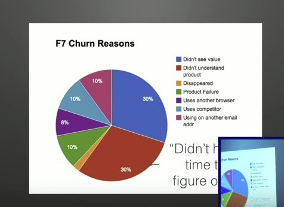

# 第6章：Onboarding 引導用戶發現價值

傳統的網站可能認為把SEO或廣告做好，用戶進來網站就自然會開始使用，但實際結果告訴我們這件事情是不成立的，當用戶進來你的服務，發現不知道怎麼開始，或是上手很麻煩的話，立刻就想離開。而「Onboarding」指的正是在這一段流程上如何引導用戶，讓用戶輕鬆發現你的產品價值，所以願意留下來甚至回頭的留客手段。

（跨兩頁，黑底白字）

## 第17課 用戶為何離開？不是你不好，而是你沒教好
-----------------------------------------------------

--- 新手上路很重要！讓用戶感受到你的用心帶領

### 什麼是Onboarding？

Onboarding這個字，最早出現在Human Resource（人力資源）領域，說的是僱用一個員工後的入職引導。

包括：

-   索取員工勞健保資訊
-   發給員工「入職須知」
-   到職後，製作名牌
-   購買辦公用具
-   介紹環境
-   介紹同事
-   交接職務
-   熟悉工作流程

而這一章出現的Onboarding，指的是「User Onboarding」，應該可以翻譯成「用戶引導」。

### 多數用戶離開的主因是？

HubSpot曾經在內部跑過一項數據，調查為什麼用戶會離開？發現一件血淋淋的事實：

-   30%的人是對這個產品「沒有感受到價值」而離開
-   30% 的人是對這個產品「不知道怎麼操作」而離開
-   10% 的人是因為「product failure」而離開
-   只有10%的人是覺得其他競爭對手比較好才離開

我們在前面章節有提到，Growth（成長）的公式是「Conversion（轉換率）-Churn（流失率）」，減少用戶流失，自然就帶來成長。

而從HubSpot的測試，可以發現Churn（流失）最大的主因是：

> 消費者「沒有感受到價值」、「不知道怎麼操作」。

沒有感受到價值，那是Landing Page沒有傳達清楚與誘惑的訊息。

不知道怎麼操作，就是Onboarding用戶引導沒有做好。

### 用服務業的精神做Onboarding

Onboarding其實對不管是網路服務，或者各行各業的產業都很重要，也可以說這就是一種服務業的精神，要由我們親自幫用戶了解產品，給用戶最舒服的感受，而不是丟給用戶難題，或是讓用戶自己去了解。

我們可以看看幾個現實生活中的例子，和網路服務業的例子，了解Onboarding的重要性。

#### 例子1：實體餐廳消費

什麼情況下你去實體店面或傳統餐廳，過了一陣子就想趕快離開？

我想大致上會是下列這些原因，比如說：

-   餐廳髒亂
-   桌椅破舊
-   等很久沒有人招呼

#### 例子2: 公司入職

什麼情況下你去一個公司很快就想離職？

可能有下列原因：

-   進去每天很操
-   你發現自己主掌的業務很難上手
-   前面的人不交接
-   老闆一天到晚罵你
-   覺得在這裡工作很辛苦

#### 例子3：瀏覽網站

什麼情況下你會進入一個產品頁，看沒有30秒就想關掉？

可能有下列原因：

-   進去不知道這個網站要幹嘛
-   註冊要填很多東西，很煩
-   你已經想要買一項商品，但是心裏還是有一些疑慮
-   線上找不到客服可以問
-   最後只好閃人

有沒有發現，其實無論經營實體店面還是做網站的Growth Hacking，其實還是不脫我們前面提到的核心宗旨：「增強顧客信心，降低客戶疑慮」。

而除了Landing Page給你的顧客一個好看的店面外，接下來如何引導顧客，讓他們快速了解你的服務、提供他們需要的解答，這一系列的導引過程，也可以說是讓用戶新手上路的過程，就是成長駭客策略裡非常重要的「Onboarding（用戶引導）」。

### User Onboarding的核心價值

這就說明了為什麼「User Onboarding」是Growth Hack 中非常重要的一環。

User Onboarding翻為「用戶引導」，也就是要讓新用戶註冊後，服務可以透過一系列的互動引導：

-   讓用戶了解這個產品如何使用
-   讓用戶體會到產品的核心價值
-   讓用戶養成使用這個產品的習慣

這個流程決定了 Customer 是否會回頭再使用這個產品，是否繼而愛上這個產品，養成習慣並成為回頭客。

幾乎市面上主流的網路服務，都非常重視Onboarding，網站並非就是等著網友進來而已，經營網站其實就像實體店面服務業一樣：

> 你必須用心服務你的來客

## 第18課：網路與服務業一樣！你必須時時照顧你的顧客
--------------------------------------------------------

--- Onboarding這樣做！導引顧客的三法則八步驟

### Onboarding用戶引導的具體三大法則

在《The Membership Economy》這本書中，把Onboarding拆解成三大法則八大步驟，他的分析方法可以說把如何做Onboarding拆解得淋漓盡致。

其中Onboarding的三大步驟尤為重要分別是：

-   消除疑慮、降低挫折
-   馬上為用戶帶來好處
-   根據行為給予小惠

能夠消除來客的疑慮，降低第一次使用我們服務的挫折感，這樣來客才會願意繼續學習我們產品的使用。

接著我們應該想辦法找出產品可以帶給用戶的立即好處是什麼，並且把這個使用方法設計成引導用戶的第一個流程，讓用戶一使用我們產品，就立刻感覺到價值，增強他們的信心。

然後不可或缺的是用戶都是喜歡優惠的，在用戶持續使用產品的過程中如何可以提供不同的甜頭，讓用戶感覺到產品常常可以提供額外的回饋，那麼用戶就會慢慢成為忠誠的顧客。

是不是非常簡潔明瞭呢？但仔細檢查我們自己的服務，其實很多細節我們都沒有做到。

### 消除疑慮、降低挫折的步驟

要做到Onboarding的三大法則，有一些具體的網站經營步驟，讓我們一起來看看。

首先，想要消除疑慮、降低挫折，我們就要在註冊頁、歡迎頁上面用心引導。

#### Signup：註冊引導

讓註冊步驟變得盡可能簡單，讓用戶輕鬆就能完成註冊。如果你是付費服務，那麼這時候可以提供一定期間的免費試用。

#### Welcome：歡迎頁面

用戶註冊完成後，馬上感謝顧客註冊，並讓顧客馬上感受到「他們是為了什麼而來？」簽完不要註冊完成後就直接開啟產品，要用戶自己去學，而是註冊完後更要好好地引導用戶。

### 馬上為用戶帶來好處的步驟

要怎麼讓用戶很快地知道這個產品對他們的價值是什麼呢？可以在下面幾個網站營運環節下功夫。

#### Engage immediately ：

可以在用戶註冊完成後，馬上出現引導，提供他們一個有價值的服務，鼓勵用戶立即做出「關鍵行為」，通常是這個產品最有價值的功能之一。

#### Ask for feedback：

在第一週就建立和用戶之間的溝通管道，例如打電話、寄信給用戶等等，聽取用戶對服務的回饋，讓用戶感受到產品確實想要幫助他們。

#### Provide feedback：

許多優秀的服務還會定期的寄信或通知用戶，給予用戶如何更加強化「服務價值」的建議，也就是教用戶如何正確的使用這個產品，並獲得收穫。

### 根據行為給予小惠的步驟

至於如何讓用戶持續地感受到一些甜頭，可以試試看下面的方法。

#### Ask for referrals：

提供一些優惠，鼓勵顧客邀請朋友前來消費。

#### Begin Customizing the experience using data analytics：

可以使用資料分析，給予顧客更量身打造的產品使用體驗。

#### Transition to a nurturing program：

持續提供產品相關的學習資訊，讓會員能夠更強化他們來消費的體驗。

## 第19課：Onboarding實例，為何他們抓住顧客的心？
------------------------------------------------------

--- 請你也跟著這些範例一起演練看看Onboarding的三法則八步驟！

接下來我們會示範幾個例子，介紹如何實作Onboarding。

這兩個例子分別來自於實體店面，以及線上服務，讓大家可以做一個對比，並實際練習看看：

-   鐵板燒餐廳的例子
-   線上音樂的例子

### 實體服務業如何做User Onboarding？

台灣對於Onboarding實作最深最好的行業，其實應該是服務業。

國外拆解Onboarding的實例多侷限在App的引導頁面如何設計上，但這樣似乎很難找到一些共通的精神去應用在其他服務上。

起初我也對於如何講解Onboarding這個架構頭痛，直到我想起我最愛的鐵板燒餐廳的服務過程，他們是如何第一次讓我造訪就上癮，並進而變成常客，我發現這其實就是一種Onboarding。

就讓我們用第18課所說的Onboarding三大法則與八大步驟，一一拆解。

#### Step 1：消除疑慮、降低挫折

##### 「Singup：讓註冊步驟變得盡可能簡單，若是付費服務就提供一定期間試用。」

在我第一次踏進去那家鐵板燒餐廳，10秒內就有服務生過來詢問帶位。

##### 「Welcome：馬上感謝顧客註冊，並讓顧客馬上感受到他們是為
了什麼而來。」

服務生在帶位並介紹菜色以及消費方式後，就立刻招待我一碗湯暖胃。（喝了湯就不會想離開了）

#### Step 2：馬上為用戶帶來好處

##### 「Engage immediately：馬上提供有價值的服務，鼓勵他們做出
關鍵行為。」

在我喝了幾口湯後，服務生接著過來點菜，他先再給了我一盤主廚招待的小菜，然後問我有沒有偏好的食材，我說偏好吃牛肉，他就說師傅最近進了一批和牛，推薦點這道菜，我於是點了五分熟的和牛牛排。

在上菜之前，師傅也先炒了美味的櫻花蝦高麗菜先讓我墊墊肚子，服務生也貼心的提醒餐廳
可以無限續湯，讓我覺得金甘心。

依據我的喜好，快速提供我想要的並且有價值的關鍵行動，我便無法離開了。

##### 「Ask for feedback：在第一週就建立溝通管道，聽取服務回饋。」

牛排很快就上桌了。在我品嘗第一口之後，師傅很快的來請教我的意見，因為我點的是五分熟，就口感來說這塊牛排雖美味但有點過熟（七分）。

我誠實反應回去，師傅誠懇地說因為第一次來的客人，他們怕作過生的話，客人反而會不敢吃，所以通常都會把牛排做得熟一
點。不過沒關係，既然我吃得出來，他會再做一塊新的給我，舊的就當請我吃。（這讓我很驚訝，單價這麼高還是不吝嗇地重做）

##### 「Provide feedback：給予如何更加強化服務價值的建議。」

吃著吃著，師傅也跟我聊起天來，他看我很喜歡吃牛排，他說：你知道牛排沾葡萄酒醋風味
更好嗎？（那時候我是不知道的）

接著他拿出兩瓶葡萄酒醋介紹，師傅說，一般外面如果想買葡萄酒醋自己配牛排，外面市售的葡萄酒醋大概都是5年的醋。然後他滴了兩滴在盤子上，讓我試一下，我試過之後發現配牛排果然很棒。

接著他再拿另外一瓶跟我說，這一瓶是他私藏的25年紅酒醋，外面很難入手，一小瓶就要破
萬，等於一滴就要幾百元。接著他也滴了三滴在盤子上（驚訝）請我試試。這個手法超厲害，不斷在強化其服務的附加價值。

#### Step 3：根據行為給予小惠

##### 「Ask for referrals：鼓勵顧客邀請朋友前來消費。」

這餐我吃的相當開心，在結帳櫃檯時，老闆笑著對我說，覺得很棒的話，可以幫我們在Facebook分享給朋友知道嗎？

於是有一陣子我常常回到這家餐廳吃飯，並拍照分享到FB。

##### 「Begin Customizing the experience using data
analytics：使用資料分析給予顧客更量身打造的體驗。」

後來，老闆與師傅都記得我喜歡吃什麼菜（以及加什麼佐料）。於是我的高麗菜固定都會自動炒辣，湯都是固定上兩碗，而且每次牛排師傅都會實驗不同的形式。

##### 「Transition to a nurturing
program：持續提供資訊讓會員能夠更強化他們來消費的體驗。」

每次回去用餐時，師傅都會分享不同的小訣竅，讓我體驗同樣一道菜的不同烹飪手法與口
感，並且開始掌握我口味的喜好，適時推薦我絕對會喜歡的菜色與魚貨。

你會發現，其實這家餐廳已經做足了Onboarding的流程。

如果你也是經營實體店面，或者你提供的是像講師、課程、面對面的服務，那麼或許上面的例子很值得你好好演練一番。

### Onboarding為什麼可以抓住顧客的心？

Onboarding如何要說有什麼金科玉律的話，那麼大概就是下面這句話：

> 讓顧客輕鬆體驗到價值

在這個服務過程當中，我感受到這家店營運的用心。

店家透過一系列的onboarding手法，讓我體會到這家餐廳的價值，並且讓我義無反顧地成為死忠回頭客，並積極幫忙宣傳。

店家毋需推銷、毋需請我填上冗長的表格，就掌握我的消費喜好，並讓我成為他們最大的推
銷員。

台灣的服務業或許上面的案例很常見，但如果回頭去看看我們的網站、服務，是不是常常違反了上面的準則？

例如很多網路服務為了想要做精準行銷，最後決策就會演變成在註冊頁面：請消費者在註冊表格填一堆瑣細的興趣資料。

試想，如果一家餐廳在門口，問你幾歲？從事什麼職業？你還會想要進去消費嗎？

所謂精準的行銷，要把首次顧客轉成「超級用戶」，是靠一系列的Onboarding，觀察出客戶的喜好，並貼心客製化，而不是坐在辦公室設計出三頁長的註冊表格，客戶才不會買單！

下一節我們會介紹，一個好的網路Onboarding應該如何實做。

### 網路服務如何做User Onboarding？

相信大家都有註冊國外服務，並且在註冊後收到他們很多信件的經驗。

但是很奇怪的，傳統以為郵件這麼多，你應該會覺得很煩，但不知為何，收到這麼多信，你反而會覺得他們就是貼心，流程很順暢，因為這些國外服務的來信常常是有效的用戶引導，最後常常就讓你莫名其妙付費升級成正式用戶了。

這就是User
Onboarding的威力，在這裡我也用同樣的結構拆解給各位看。這裡以一個「線
上音樂服務」作為實際的例子。

#### Step 1：消除疑慮挫折

##### 「Singup：讓註冊步驟步驟變得盡可能得簡單，若是付費服務就提供一定期間試用。」

儘量讓註冊手續簡化，千萬不要像傳統網路服務那樣要顧客填寫一長串表單，現在大多國外服務甚至都可以直接利用Facebook帳號就能註冊登入。

##### 「Welcome：馬上感謝顧客註冊，並讓顧客馬上感受到他們是為了什麼而來。」

我使用的這個線上音樂服務，首次註冊就贈送30天試用，並且寄出第一封Welcome信簡介服務，歡迎與引導我探索這個服務的核心功能。

#### Step 2：馬上為用戶帶來好處

##### 「Engage immediately：馬上提供有價值的服務，鼓勵他們做出關鍵行為。」

線上音樂服務的核心價值就是聽歌。

一般使用者使用音樂服務的具體流程是：

-   探索到喜歡的歌手
-   找到喜歡的歌
-   把這些歌編排成一張歌單
-   循環播放

於是這個網站會設計一個貼心的導覽教學，引導使用者能夠輕鬆找到他喜歡的歌曲分類以及
歌手，並且具體建立歌單，開始播放音樂。

##### 「Ask for feedback：在第一週就建立溝通管道，聽取服務回饋。」

接著該音樂服務網站營運團隊發現，每一個「會留下來」的使用者，至少會建立三個歌單。

所以當系統記錄到一個用戶只創了兩個歌單就停住不使用了，就會發信問使用者是否在哪個步驟卡住了，並給予協助。

##### 「Provide feedback：給予如何更加強化服務價值的建議。」

當系統發現這個使用者持續使用，且建立超過五個歌單過後，會開始給予一些更能夠體驗這
個服務價值的建議，比如：

-   下載iOS版本app隨時可以享受音樂
-   桌面軟體的歌單備份功能
-   同步到手機的方法
-   音質調整
-   耳機推薦

#### Step3：根據行為給予小惠

##### 「Ask for referrals：鼓勵顧客邀請朋友前來消費。」

當系統已經發現這個使用者黏著度非常高之後，這時候就會開始寄出推坑的CALL
TO ACTION信：「現在註冊一年就送2個月會員。」

這就是為什麼當許多人在用一些歐美服務時，通常最後會相當自然的付費的原因。

而在會員付費幾週後，系統會自動再寄出問卷調查（所謂的NPS，後面章節會提到這個手段），若會員推薦服務意願相當高時，這時候系統會寄信問你說，你願不願意介紹這個服務給你的朋友們。

只要你介紹一個會員加入，我們就送你會員一個月資格。

所以我們常常看到很多朋友在FB出賣他的數位人格（笑）。

##### 「Begin Customizing the experience using data
analytics：使用資料分析給予顧客更量身打造的體驗。」

建立5個歌單之後，系統會開始知道這個用戶喜歡哪一位歌手，這個用戶喜歡聽什麼類型的歌曲。服務就開始可以推薦他喜歡類型的歌，讓他在歌曲庫發現更多驚喜。

##### 「Transition to a nurturing
program：持續提供資訊讓會員能夠更強化他們消費體驗。」

根據用戶的建議，逐漸修正且打造更好的產品，並且持續提供娛樂與互動資訊，讓客戶能與這個服務有更緊密的聯繫。

這樣一輪Onboarding流程跑下來，使用者會發現，這個網路服務真的有在關心你，這個服務真的有提供他宣稱的內容，使用者也體驗到這個服務的價值。

而且這個服務精準的知道你的喜好，並且針對你的喜好客製服務體驗，你付錢付的心甘情願，最後也想把這個優秀的服務推薦給朋友。

要做精准行銷，真的不需要在註冊表格，逼使用者填一大堆資料，Growth
Hack更偏向利用累積起來的用戶行為資料，在精準的時機，貼心的讓你掉坑（而且還是自願的）。
