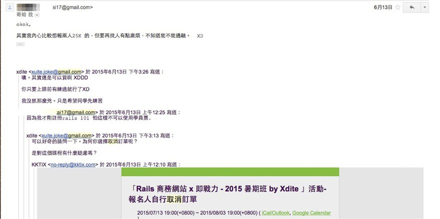
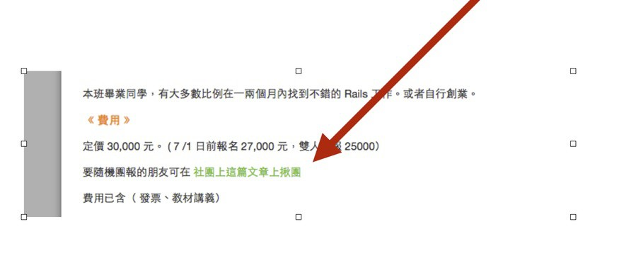

# 第7章：Customer Support 客服就是金礦！
==============================================

＠Opening：

傳統的商務模式常常討厭做客服，覺得那是一件很麻煩的事情，反正我就是多帶一些人進來就對了，要買的自然會買，不買的就拉倒，但真的是這樣嗎？在資源有限、宣傳效果有限的情況下，我們如果可以讓進來的人都沒有疑慮且願意買單，那麼這樣做起成長是不是更快速有效？而這時候好的客服支援就是不可或缺的。

（跨兩頁，黑底白字）

＠中標：第20課：客服是賠錢貨？還是成長與賺錢的關鍵因子？
--------------------------------------------------------

＠副標：打破客服刻板印象，重新認識客服在轉換率上的關鍵作用

＠內文：

### ＠小標：傳統對「客服」的刻板印象

這一章講的是Customer Support，也就是俗稱的「客服」。

看到這裡，讀者一定會覺得很奇怪，Customer Support到底跟Growth
Hack有什麼關係？做好客服會帶來更多的用戶與更多的購買嗎？

會有這種想法，是因為幾乎沒有人把Customer
Support與Growth的印象連在一起。大家對於Customer
Support的刻板印象不外乎是：

＠清單：

-   客戶寫來的信都是在罵我

-   客戶喜歡問一些很神經病的問題

-   客戶常問我一些沒有賣的東西

-   客戶會提出無厘頭的需求

所以「客服」讓人相當頭大。

做生意最後大家常常碰都不會想碰Customer
Support，但是迫於無奈下，還是要有人負責守門，最後只好聘僱一個人專職回客服信，但常常就是「應付一下」。

所以大家對客服最後的印象不僅跟成長無關，還認為「客服」是「無奈的成本」，怎麼會賺錢？

### ＠小標：別忘了降低流失率，是成長的關鍵公式

我們在本書一開頭就一直強調，Growth
Hack和傳統行銷手段的不同，在於比起不斷帶來新用戶，成長駭客更強調的是讓流失率降低，讓轉換率提高，讓看過妳產品的用戶更願意買單，這樣自然就實現成長。

前面我們提到的Landing
Page與Onboarding手段偏向提高轉換率，而這裡講的Customer
Support，則聚焦在如何降低流失率上。

為了說明Growth不只是「增加轉換率」，「降低流失率」也是Growth的其中一個方向。在這裡我想要特別舉自己經歷的一個例子：如何透過做客服，讓我開設的Rails班瞬間爆滿。

### ＠小標：成長駭客應該關注那些被取消的訂單

傳統的行銷關注再把人帶來，至於哪些人看過後離開了，甚至下單後取消訂單的人，傳統行銷並不關注，他們只要繼續帶新的人進來即可。

可是從我下面的例子會發現，關注、照顧這些取消訂單的人，其實是成長的關鍵手段。

有一天我在我的信箱，收到一封信，這是一封取消報名我的Rails專班訂單的通知信。

{width="6.267716535433071in"
height="3.125in"}

＠圖：part7-1

要是在以前，對方取消我是絕對不會多問原因的，學生不報就算了。

但後來因為研究Growth Hack之後，了解到「取消訂單」就是Churn
Rate（流失率）增加的原因之一，因此我開始會對Churn Rate相當注意。

所以那次，我一反常態，好奇的寫信去詢問：「為什麼您取消了訂單呢？」

結果事情是這樣的，當時Ruby on
Rails這一門課，要價27000元，為了促銷，我在報名頁寫了雙人團報25000元。

這位同學報名了27000元的課程，在付錢之際，才看到了這則特價訊息，於是決定先行取消決定等團報。

我透過寫信問他原因，發現他不是對我的課有疑慮不報，他只是想要等特價。而這位學員說，既然我開口問
了，若我願意直接給他25000元的優惠價，他立馬報名。或者是我主動幫他找團報的同學也可以。

大家猜猜我後來怎麼做？是直接解決這位單獨客戶的問題嗎？當然不是！

### ＠小標：客服，幫你找到降低流失率的關鍵手段

真正的成長駭客要從客服裡找出來的不是單獨某一位客戶的問題，而是當某個環節造成一兩位客戶問題時，一定要會造成其他客戶的疑慮，這時候改進獲最佳化這個環節，就能帶動其他客戶也一起成長。

於是我研究了一下，就決定在Ruby on Rails社團裡面貼了一則招生廣告。

接著在報名頁的FAQ上，做了一個
「團報傳送門」連結，指到這則廣告上，告訴大家可以在這裏團報。

{width="6.267716535433071in"
height="2.736111111111111in"}

＠圖：part7-2

結果當天結束，這個班報名就滿了！

因為我的這個新的設計，瞬間湧入10個人報名，我才發現原來大家其實都在觀望而已。

而如果當天我沒有寄出那封客服信的話，可能招生速度還會慢上不少。

從這件事上我才發現Customer
Support的威力，很多報名觀望的潛在顧客，缺的就是臨門一
腳而已，客服的回饋則幫我找到了那一腳在哪裡。

這件事看起來我好像表面上損失了一些收入：2000x10=2萬。但開班的老師，最怕的其實是班沒有滿，而我只做了這樣小小的一件事，就瞬間拉到10個學生。

所以為什麼Customer
Support跟Growth很有關係？其實是好的客服支援，可以讓你發現很多沒有自己從來想到的「客戶流失」原因。

只要把這些原因修掉，成長自然就會產生。

＠中標：第21課：成功的客服，會幫你找到產品更好的方向
----------------------------------------------------

＠副標：不要害怕做即時客服，我親身親歷的客服強大威力

＠內文：

如果你曾經逛過我的課程報名頁面，或者是上過我的課（可看：http://courses.growthschool.com/），眼尖的朋友應該會注意到右下角有一個留言Widget，可以讓線上客戶立即與客服溝通討論。

我使用的這個網站即時客服系統叫做「Zopim」（[[https://www.zopim.com/）。]{.underline}](https://www.zopim.com/%EF%BC%89%E3%80%82)

{width="6.267716535433071in"
height="2.5277777777777777in"}

＠圖：part7-3

這是很厲害的Customer
Support武器，我曾經推薦很多人裝過，但很多人都不願意裝，因為大家對客服可以發揮的功效，以及從客服收集用戶回饋後的應用方法，都還留在傳統的認知上。

### ＠小標：你為什麼不想裝線上即時客服Widget？

或者有些朋友不是不看重客服，而是害怕下面這些原因：

＠清單：

-   覺得如果自己常常不在線上，會讓人家感覺很沒有禮貌。

-   但一直在線上的話，也會感到壓力很大。

所以索性不裝。

但很多朋友不知道，這個小小簡單的 Widget，其實幫我帶進超多業績。

### ＠小標：不在線上，客服系統依然可以帶來高轉換率

我的確一天到晚不在線上，但顧客會接受這件事實，轉而留言給我。我收過很多利用這個Widget傳送過來的問題。

而如果可以克服這些問題，帶來的銷售轉換率會相當可怕。有多高？我的經驗是高達90%。

幾乎在上面問問題的顧客，最後都會買，如果我本人當下親自在線上的話，甚至可以達到轉換率100%。

因為很多人會造訪我的網站，初步來看有些人也是潛在粉絲，可以遇到本尊在上面親自回應，我那時候賣他什麼東西，他購買的意願就提高了。

很多人聽完這個小故事後，會有人詢問類似的服務一個月多少錢？然後猶豫要不要花這個外掛的費用。

但我的回覆都是，真正做生意不會在意這個軟體多少錢？

我開設的一門課程30000～40000，但這套軟體服務月費才700元而已，裝了就能帶來許多銷
售機會，為什麼不裝？

### ＠小標：線上問答Widget威力強大的原理

為什麼這個Widget威力這麼強大？

其實背後正是成長駭客所要強調的：「降低客戶疑慮，增加客戶信心」的流程。

因為Customer來到你的網站，表示已經對你賣的東西高度有興趣了，已經差一步要購買了，只差最後幾個疑問而已。

如果他願意透過客服系統留言給你，這是你最後一個挽留他的機會，當然要一定想辦法「轉化」他才對。

而且這樣的客服系統，其實就是對你的核心顧客最好的調查系統。

像很多創業書會建議創業者上街訪談，但是很多創業者生性害羞，所以老是在猶豫「真的要上街嗎？」其實真的不需要上街頭發問卷，你光靠做客服，就可以收到很多正面的或負面的feedback。

在客服信裡面，顧客更會直接問你有沒有什麼他們想買的產品方案、解決方案，讓你可以有針對性的賣給他他想要的東西。

像上一節的例子，好像表面上我一個顧客少賺2000元，但是傾刻之間，一個小改善，就換到另外10個人報名。

但是那一個觸發點的誕生，是我之前完全沒有想到的設計，但透過顧客告訴我。

### ＠小標：顧客會幫你找到產品更好的方向

除此之外，潛在顧客也會透露很多題目。

一開始開設成長駭客課程時，我因為想推廣Growth
Hack，真正想前進的方向是針對開發者的Workshop工作坊。
但是市場需求好像沒有那麼高，我也不確定台灣瞭不瞭解Growth Hack這個主題。

後來我回台灣分享了一次簡單的Growth Hack主題，然後有聽眾抱怨，Growth
Hack技術面的東西太雜太難了，建議我可不可以把這個主題包裝得簡單一點？

所以我把難度降的很低，降到「一般人不懂技術也聽得懂」，然後，講座的票就瘋狂的大賣。

在我開設專案管理班的時候，原本針對的TA是PM與RD，但很多觀眾也反映，是否我可以
再多設一個小型Startoup的專班，或生活上的具體專案管理。

這些可以說透過客服反饋的過程，讓我可以在創業過程去發現下面這些產品成長關鍵：

＠清單：

-   有真實需求的題目（消費者願意付錢）

-   產品具體改進的方向

-   之前完全沒想過的潛在市場與顧客

＠中標：第22課：客服不只是支援，而是降低疑慮、增強信心手段
----------------------------------------------------------

＠副標：客服其實是成長駭客公式裡，提高轉換率與降低流失率的關鍵手段

＠內文：

### ＠小標：你必須解除消費者疑慮

其實，像我的Rails課程班剛開始時，轉換率也沒有很高。

那時我在信箱最常收到的疑問是這個問題：

Rails即戰力班是開4次，然後每次3小時，收30000元。但別人都是開時間很長的Rails養成
班，而且是連續開3個月，或者至少8週。為何我可以開這麼貴？時間又比較短？到底厲害在哪裡？

我從線上客服，發現每個人猶豫的點幾乎都是這個問題，顧客都會問這門課跟別人有什麼
不一樣？

於是，我就知道必須在第一階段就嘗試解決這個顧客疑問。

### ＠小標：主動出擊！線上服務與產品不可或缺的FAQ

透過收集客服來的疑慮，我知道如何改進自己在報名網頁上的FAQ問題清單。

後來我就在FAQ加了這兩段：

＠小小標：Q：這個班跟其他的Ruby on Rails班有什麼不一樣？

A：

1)
我個人非常注重養成學生的實戰能力，所以我不會教職場上無法用的到的東西。曾經跟我學過Rails技術的開發者，很多都已經變成國內非常頂尖的Rails開發者了。而且他們成長的速度都非常的快，平均1-3個月就有辦法從完全沒寫過程式，到自主開發功能或者是產品。

2)
這門課是專注於就業導向或做產品，不是教虛無縹緲的「理論」。我擁有非常多產品實務開發、深厚專案管理經驗，甚至「面試」以及「培養Rails開發者」的經驗。所以基本上學生的疑難雜
症，我都有辦法給出精確的建議與方向。保證不浪費你的時間。但建議學生也投注一定的時間「練習寫程式」。

＠小小標：Q：這個班比起別人的Rails班時數少很多，這樣有效嗎？

A：

1)
上課內容貴精不貴於多。其他高時數的班內容很多在講解，以及練習「網路上就找得到的免費基礎內容」
，如果你希望學這一類的基礎內容，我有一個免費的線上課程Rails 101課程
。參加這個就好了，不需要多花錢。

2)
本班的上課內容，90%比例在於「真實戰場上的經驗」，從如何做軟體規劃開始（這是多
數初學者的障礙），到映射到整套Rails架構的設計，結訓產品是實際上線的商務網站。這是其他課程所沒有辦法提供的。

3)
此外每週上課的3個小時，我們專注傳授核心心法架構（在業界才學得到，前輩還未必想
教你）。實際下課後還有回家作業，學生還需寫上3-6個小時（有解答）。也提供助教會在slack或實體meetup的office
hour解答，實際上是一個月會花上約 36-40
小時在學習。而且學的都是最精華的技巧。可以少走很多冤枉路。我相信這是同學最想得到的結果。

4)
這個班已經畢業了幾十個學生，相信你去問上過課的學長們，每個都會跟你講內容是太多太紮實，不是太少。

後來把答案貼上去後，就再也沒人問這個問題了，下單的轉換率也提高許多。

### ＠小標：還是萬變不離其宗：降低疑慮，增強信心

為什麼這兩段 FAQ 這麼有效？

想要把東西賣給別人，或者說成長駭客的精神，其實你要做的只有二件事情：降低疑慮，增強信心。

把客服做好做滿，其實就會幫你發現很多商機。

不要放棄你的客服支援，如果你有線上網站，回去裝上前面提到的這一套Widget，你真的會發現在顧客的回饋裡充滿商機，在客服信被顧客罵一下，忍一下就過去了！

### ＠小標：賣Customer想要買的東西，不是你想要賣的東西

客戶自始至終想買的是「他想要買的方案」，不是「你想要賣的東西」。

前面我們提到成長駭客的另外一個關鍵是「做出好的產品」，而做出好產品的核心，就是打造出顧客想買的方案。

大家創業都會覺得自己賣的東西很了不起，滿心只賣自己想要賣的東西，如果顧客問服務以外的問題，還把顧客當作都是來亂的。

為什麼有一些人創業做不起來的原因，就是一直這樣抱持著本位主義，覺得自己的東西很無敵，
只是缺乏曝光，或者沒有曝光到正確的用戶面前。

而為什麼有一些人創業，一下子就站穩腳步，因為他做得很單純，就是：

＠大字引言設計：

賣大家想要買的東西。

\@引言完\-\-\-\-\--

創業要具體前進的方式，就是藉由Customer
Support的機會，去解決顧客的問題，解決問題 就可以帶來更大的商機。

透過這樣的方式，其實你根本不用煩惱如何挖掘下一個大賣的主題，顧客都會主動告訴你。

所以客服系統其實就好像源源不絕的金礦，這就是為什麼我現在每天都在回Customer
Support，因為對我來說，Customer Support上的feedback，就是金礦！
