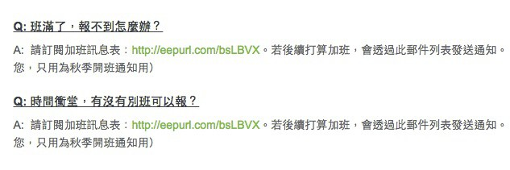
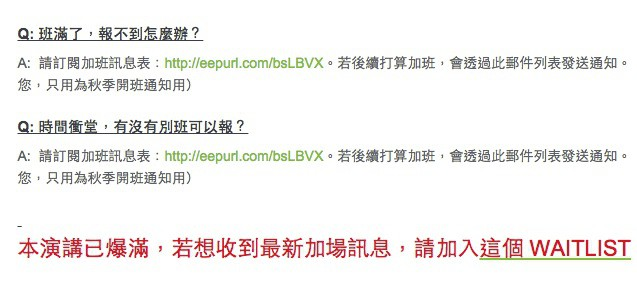
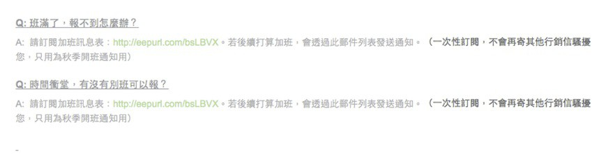
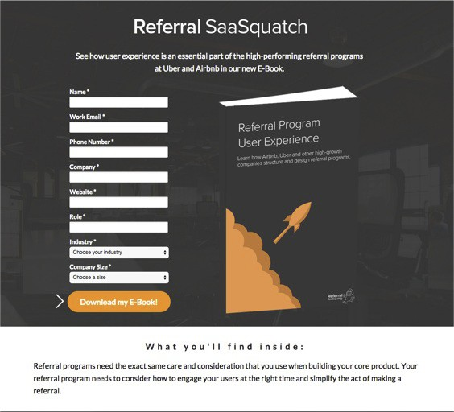
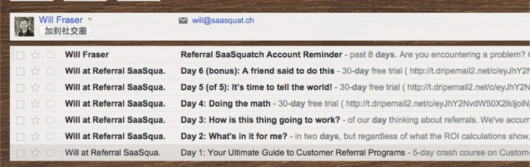

＠大標：第8章：Email List 留住你的銷售機會
==========================================

＠Opening：

當我們只想到要砸錢去找到更多銷售機會時，其實成長駭客們回到傳統的郵件名單收集上，透過有效的內容行銷手段，透過不打廣告的郵件服務，透過Email
List留住潛在的顧客，持續透過信件與潛在客戶溝通，直到有一天，他們需要你的服務或產品時，總會第一個想到你！

（跨兩頁，黑底白字）

＠中標：第23課：最傳統的寄信，是最好的留客手段
----------------------------------------------

＠副標：你的來客進來又走了，為什麼不留下以後找到他們的管道？

＠內文：

什麼？Email List？

看到這裡，你應該會覺得很奇怪，Email List不是很舊的招式嗎？怎麼會是Growth
Hack中的 一環？這其實端看你怎麼利用。

我用E-mail List做兩件事：

＠清單：

-   留住可能會流失的潛在客戶

-   養出未來潛在有興趣買單的用戶

而其實你去觀察國外許多最先進的網路服務，大家都非常注重Email
List，當然，和發傳統的廣告信不同，當我們握有感興趣用戶的名單後，我們要用郵件做深度的內容行銷。

### ＠小標：留住可能會流失的潛在客戶

我的Intro to Growth
Hack課程自從改版後，報名狀況就很踴躍，最常見的狀況就是一開放報名當天就滿，很多朋友報不到就一直透過前面提到的客服widget來詢問。

其實這對我來說，也是很傷腦筋，每一封來信想補報的客服信，就表示一個正在流失的銷售
機會。

如果我不想辦法把這些當下有興趣的人留住，那以後每次重開報名活動時（一個月後），我可能又要面臨著炒熱氣氛的宣傳負擔。

於是我就想到，開發一個「WaitList」系統，讓這次報不到名的朋友，把自己的信箱填上去（其實就是收集Email名單），下一次開課可以補報。

### ＠小標：我用最傳統的郵件名單，讓顧客不會每次流失

＠小小標：我的改進Version 1：把等待報名郵件名單放在FAQ中

一開始我是這樣做的，我把waitlist放在FAQ中。

{width="6.267716535433071in"
height="2.0833333333333335in"}

＠圖：part8-1

但還是拼命有人寫信想要補報，後來我實在好奇了，只好逮住其中一個寫信來的顧客問，我不是已經把waitlist放在FAQ中了嗎？為何你們沒看到？

顧客A ：字太小，誰會去看？

顧客B：我根本不知道那是wait list。

＠小小標：我的改進Version 2 ：放大變成紅字

聽了這些朋友的建議，於是我在活動頁面最下方，把「請加入這個WAITLIST」這行字變紅變粗，於是加入的人開始變多了。

{width="6.267716535433071in"
height="2.763888888888889in"}

＠圖：part8-2

不過加入的速度還是差強人意。

後來有朋友在Facebook上問我，請問這個waitlist只會寄一
次信嗎？他不想被spam。

＠小小標：我的改進Version 3 ：保證只寄一次通知信

我才意識到不是每個人都信任Email List，所以我再對這則訊息改版了一次。

{width="6.267716535433071in"
height="1.5833333333333333in"}

＠圖：part8-3

改成這一個版本後，加入waitlist的速度與人數就瘋狂暴增。

於是我從這裡也學到了同樣的改進原理。

Customer不願意照我設立的指示走，只是因為他充滿疑慮，缺乏信心。

所以所有的轉換率改善手段與方向，也不需要太複雜，遵循「降低疑慮、增強信心」這兩個
原則就可以了。

### ＠小標：利用Email List儲存銷售機會

透過讓想報名而報不到的人留下名單，我將這次可能即將消逝的銷售機會儲存起來。

然後趕快去book新的場地，設定好新的課程，過一週當我準備完成之後，再次寄信給名單上的朋友，結果高達40%的轉換率。

我接下來幾次票賣光後，改用這樣的名單通知方式，轉換率高達25-60%。

＠中標：第24課：有效郵件行銷實戰，養出潛在的未來顧客
----------------------------------------------------

＠副標：郵件是最有針對性的內容行銷，是你和顧客溝通的最佳管道

＠內文：

### ＠小標：用郵件作內容行銷，培養你的顧客

Email還可以用在另外一個反向用途：做Content
Marketing（內容行銷），把未來的顧客養出來。

這裏我用一個矽谷的SaaS服務「ReferralSaasquatch」做例子。

ReferralSaasquatch是一個幫新創SaaS服務做「Referral
Service」的網站，它主要提供幾個方向的Referral解決方案：

＠清單：

-   Referral Widget

-   Referral Billing / Discount

-   Referral AntiFraud

別看Referral原理簡單（Give \$10 & Get \$10
)，事實上實作起來比你想像的麻煩。

＠清單：

-   必須處理折價時註冊的問題

-   必須處理累積獎項 ( Give \$100時的特殊discount）

-   必須處理帳單

-   必須處理想要詐騙免費服務的騙子

這幾乎是每一個SaaS服務的痛，於是就有人想到以做Refferal工具這件事為創業主題，但問題是：

＠清單：

-   Referral是一個非常小的niche市場

-   這個服務月費高達\$99美金

所以不是一般人會輕易註冊使用，更不是一般人會想付費的服務。

但是「ReferralSaasquatch」成功成長起來，獲得不少的用戶，那麼
ReferralSaasquatch 怎麼做這件事的呢？

### ＠小標：Step 1：Content Marketing送書，留下有興趣的人的郵件

他們做了下面這樣的電子書贈書頁面，吸引對做Referral有興趣的人，留下他們的Email來索取這本書。

{width="5.875in"
height="5.333333333333333in"}

＠圖：part8-4

### ＠小標：Step 2：設立Drip Email，每天傳授潛在客戶知識

接著他們拿到名單後，建立一系列的教學信，對這些朋友每天教學一些小知識：

＠清單：

-   第 1 天：Referral Program簡介與種類介紹

-   第 2 天：ReferralSassSquash.com教學介紹

-   第 3 天：昨天有碰到什麼困難嗎？

-   第 4 天：教你怎麼看懂Referral KPI

-   第 5 天：如何製作Referral Program

-   第 6 天：歸納Referral Program重點

-   第 n 天：寄送Referral Case Study...

-   第 n +1 天：寄送Referral技巧電子報

每天透過這樣一點一滴，教會你 Referral 相關的知識。3

當你覺得Referral相當重要，你又需要一個solution時，第一個想到的自然就是ReferralSaasSquash了。

{width="6.267716535433071in"
height="1.9861111111111112in"}

＠圖：part8-5

### ＠小標：不可忽視的開拓新市場利器：Content Marketing

如果你的服務很niche，市場上又缺乏這些資訊，一開始強打服務的曝光並不是什麼好事。

相反的，你應該透過一系列Content Marketing的文章，比如：

＠清單：

-   連載專業知識文章

-   整理電子書懶人包下載

換取對這些知識有趣的人的Email，透過這樣的方式教育你的市場。

養出一群希望了解這塊領域的潛在顧客，行銷這樣專業的產品就不是什麼難事了。
